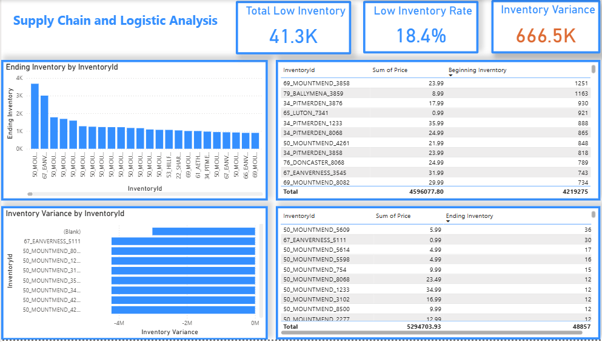
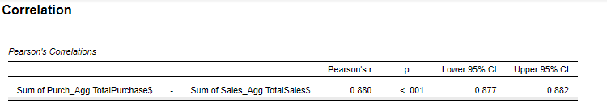
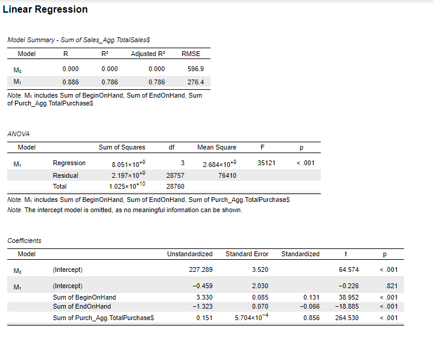

# Supply-Chain-and-Logistic-Analysis
------------------------------------------------------------------------------------------------------------------------------------------------------------------------
# Project Overview

This project presents an end-to-end analytical assessment of a supply chain and logistics operation, focusing on how purchasing behavior, inventory dynamics, and demand volatility interact to drive financial and operational outcomes.
Rather than reporting isolated KPIs, the analysis is structured to identify systemic inefficiencies, inventory risk concentrations, and decision points where data-driven intervention creates the highest impact.

By combining descriptive analytics, risk diagnostics, and forward-looking demand signals, the project demonstrates how supply chain performance can be improved through targeted actions, not blanket inventory expansion—balancing service level, working capital efficiency, and operational resilience.

 

# Project overview :

## Overview: the actual situation of the business.

## Purchase & Supplier Analysis: What is the situation regarding suppliers, and which ones are performing effectively.

## Risk Analytics: risks in warehouses

## Forecast the Trend: Forecasting commodity trends to make import decisions.

# Project objective

This project explores how operational supply chain data can be transformed into risk-focused insights rather than descriptive reporting.
The goal is to identify where inventory risk truly comes from, why it persists despite stable purchasing, and how decision-makers can respond in a targeted and cost-efficient way.

# Why this project matters

Many supply chain dashboards stop at showing what happened. This project goes further by answering:

Is inventory risk random or structural?

Is the problem driven by supply limitations or demand pressure?

Which segments should be prioritized to reduce stockout exposure fastest?

# What this project demonstrates

Translating transactional data into a problem-solving narrative

Combining BI dashboards with statistical validation

Framing insights in a way that supports real operational decisions, not just reporting

# Deliverables

Power BI dashboard for operational visibility

Excel-based analytical dataset to ensure correct granularity

Statistical testing in JASP to validate hypotheses

Consulting-style storyline suitable for decision-makers and interviews

# Below is the structured problem-solving analysis, presented across four logical steps:
Problem framing → Diagnostic approach → Key insights → So what & actions

# SLIDE 1 – OVERVIEW
Inventory pressure is driven by demand volatility, not insufficient purchasing

## What we see
Sales and purchases move at scale, but inventory levels fluctuate sharply over short periods. Large sales spikes are followed by rapid inventory drawdowns, while replenishment reacts with delay.

## What this means
The supply chain is not constrained by total purchasing capacity. Instead, it struggles to absorb demand volatility, causing temporary stock stress despite high overall procurement volumes.

## Why it matters
Treating this as a “buy more” problem would inflate working capital without fixing the root cause. The core issue is timing and alignment, not volume.

## So what
Inventory management must shift from volume-based planning to volatility-aware control, with closer monitoring of sales-driven shocks.

# SLIDE 2 – FORECAST & REORDER LOGIC
Forecast signals indicate near-term demand pressure that exceeds current reorder assumptions

## What we see
Short-term sales forecasts point to a sustained demand level that, when compared to current reorder thresholds, leaves limited buffer for unexpected spikes.

## What this means
Existing reorder points appear calibrated to historical averages rather than forward-looking demand signals. This creates exposure when demand accelerates faster than replenishment cycles.

## Why it matters
Without integrating forecast signals into reorder logic, the system systematically reacts after inventory risk has already materialized.

## So what
Reorder points should be dynamically adjusted using forecasted demand rather than static historical benchmarks, reducing reactive firefighting.

# SLIDE 3 – PURCHASE & SUPPLIER ANALYSIS
Supplier contribution is concentrated, amplifying dependency risk rather than stabilizing supply

## What we see
Purchasing volume is heavily concentrated among a limited number of vendors. While this supports scale efficiency, it also ties replenishment stability to a small supplier base.

## What this means
Inventory risk is partially structural: when high-volume vendors experience delays or mismatches in timing, downstream inventory volatility increases disproportionately.

## Why it matters
Supplier concentration magnifies operational risk, even if total purchase volumes remain strong.

## So what
The focus should move from total purchase optimization to supplier risk balancing, combining volume efficiency with resilience considerations.

# SLIDE 4 – INVENTORY RISK & LOW-STOCK EXPOSURE
Inventory risk is unevenly distributed, creating clear prioritization opportunities

## What we see
Low-inventory exposure and inventory variance are concentrated in a subset of items. Many products remain stable, while a smaller group drives the majority of risk.

## What this means
Inventory risk is not systemic across the portfolio. It is localized and predictable, enabling targeted intervention.

## Why it matters
Broad inventory increases would be inefficient. The highest return comes from addressing the small group of high-risk items driving volatility.

## So what
A risk-based inventory strategy—prioritizing high-variance, low-buffer items—can significantly reduce stockout exposure without increasing overall inventory levels.

# Strategic Summary – Supply Chain & Inventory
The situation

Despite strong purchasing volumes, the supply chain continues to face recurring inventory pressure and low-stock exposure. The issue is not insufficient supply capacity, but misalignment between demand volatility, replenishment timing, and inventory control logic.

# Key diagnosis

Demand volatility, rather than procurement volume, is the primary driver of inventory stress.

Reorder points are backward-looking, anchored in historical averages instead of forward demand signals.

Supplier contribution is highly concentrated, amplifying operational risk when timing mismatches occur.

Inventory risk is unevenly distributed, with a small subset of items driving the majority of low-inventory exposure.

# Statistical Insights & Actionable Recommendations

 

## 1. Distribution & Outliers – Inventory and Sales

Insight
Inventory (BeginOnHand) and Sales distributions are highly right-skewed, with extreme outliers dominating total volume. Median values remain low while maximum values are disproportionately large.

So what
Average-based planning does not reflect typical operational behavior and increases the risk of systematic overstocking across the portfolio.

Action

Segment SKUs based on distribution percentiles rather than mean values

Apply risk-tier inventory thresholds (e.g. P75 / P90) for high-impact items

## 2. Purchase–Sales Relationship

Insight
Purchases and Sales show a very strong positive correlation (Pearson r = 0.88, p < 0.001).

So what
Procurement decisions are largely reactive, following realized sales instead of anticipating demand, increasing exposure to volatility and bullwhip effects.

Action

Shift from sales-driven purchasing to forecast-led replenishment

Use demand signals as leading indicators, not lagging outcomes

## 3. Inventory Structure – Clustering Analysis

Insight
Model-based clustering identifies multiple inventory behavior patterns, but with low silhouette scores, indicating overlapping and heterogeneous SKU behavior.

So what
A single inventory policy cannot effectively manage the portfolio. Uniform rules increase both stockout risk and capital inefficiency.

Action

Combine analytical clustering with business segmentation logic

Apply differentiated replenishment strategies by volatility and turnover

## 4. Sales Drivers – Regression Analysis

Insight
The regression model explains a substantial portion of sales variance (R² = 0.79).
Purchasing volume is the strongest positive driver, while high ending inventory shows a negative marginal impact on sales.

So what
Sales growth is driven by inventory flow efficiency, not inventory accumulation. Excess stock does not translate into higher revenue.

Action

Introduce upper-bound inventory constraints for low-elasticity items

Optimize for inventory turnover, not stock size
